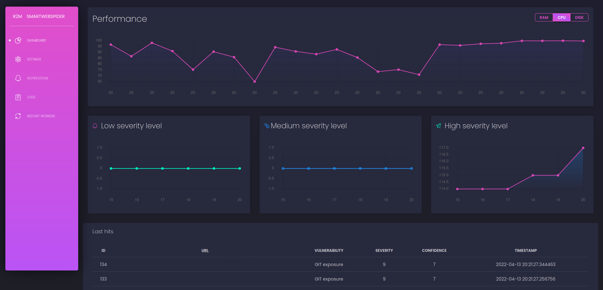

# SmartWebSpider 

SmartWebSpider is simple, speed and modular vulnerability scanner dedicated to incessantly finding and testing new websites.  
  

https://img.shields.io/badge/Trust%20Factor-9.7%2F10-green
## Installation
ToDo:
Write documentation about it.

## Write your own extension
ToDo:  

## Disclaimer:
Program is dedicated only to **legal** penetration tests.  
Developers don't take any responsibility for illegal usage!

"DISCLAIMED. IN NO EVENT SHALL THE COPYRIGHT HOLDER OR CONTRIBUTORS BE LIABLE FOR ANY DIRECT, INDIRECT, INCIDENTAL, SPECIAL, EXEMPLARY, OR CONSEQUENTIAL DAMAGES (INCLUDING, BUT NOT LIMITED TO, PROCUREMENT OF SUBSTITUTE GOODS OR SERVICES; LOSS OF USE, DATA, OR PROFITS; OR BUSINESS INTERRUPTION) HOWEVER CAUSED AND ON ANY THEORY OF LIABILITY, WHETHER IN CONTRACT, STRICT LIABILITY, OR TORT (INCLUDING NEGLIGENCE OR OTHERWISE) ARISING IN ANY WAY OUT OF THE USE OF THIS SOFTWARE, EVEN IF ADVISED OF THE POSSIBILITY OF SUCH DAMAGE." Taken from LICENSE.

## ToDo
- [ ] prepare docker compose file
- [ ] add .hg support
- [ ] write read.me 
- [ ] add CI/CD
- [ ] add extension that get new targets from DNS records  
- [ ] extend web UI
- [X] add automated database and tables creation
- [X] add Postgres and SQLAlchemy support  
- [X] add nice web UI
- [X] add filtering domains by TLD 
- [X] add .env support
- [X] add .git support
- [X] add .svn support
- [X] add multiprocessing
- [X] add nmap vulnerability scan

## Special thanks:
- To creative-tim.com for beautiful "Black Dashboard" UI 
